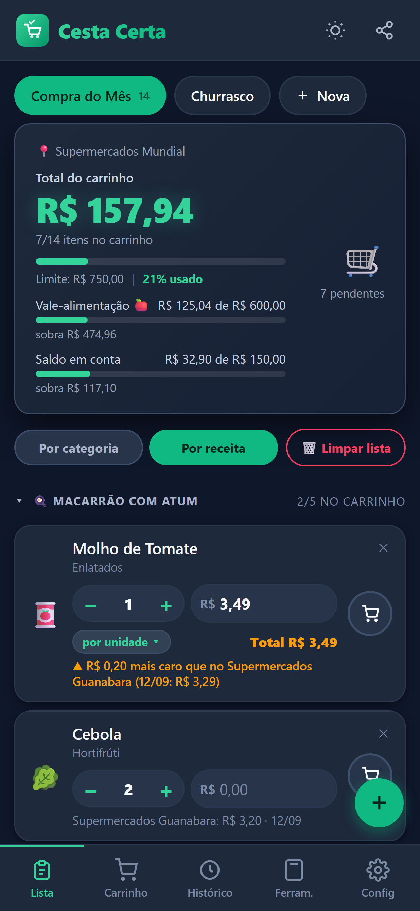
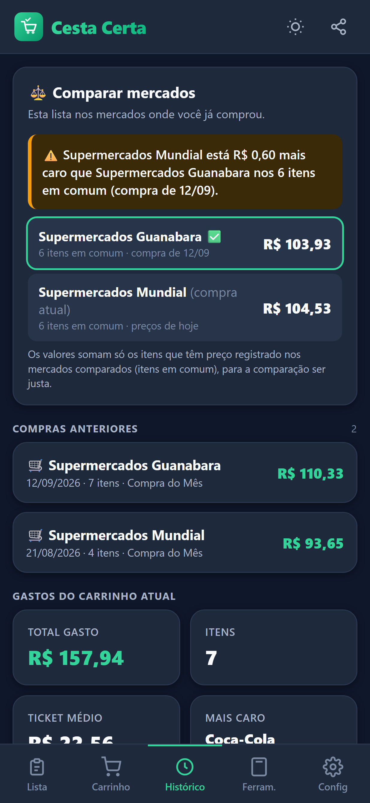
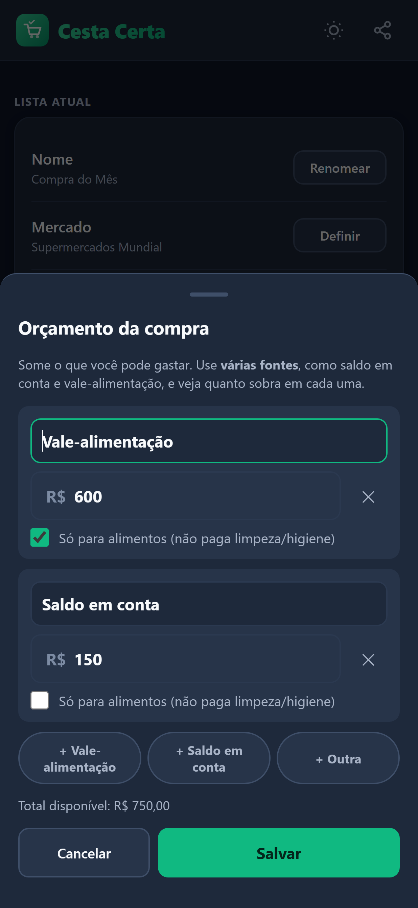

# 🛒 Cesta Certa — Lista de Compras

Aplicativo de lista de compras para o mercado brasileiro: total do carrinho em tempo real, orçamento por fonte, comparação de preços entre mercados, preço por litro/kg, calculadora de churrasco e importação de ingredientes de receitas. Funciona **offline** (só a importação de receita por link usa internet), sem cadastro e sem anúncios.

**Versão atual:** 1.4.0 (versionCode 9) · **Pacote:** `com.cestacerta.lista` · **Estado:** pronto para teste fechado na Play Store

| Lista por receita | Comparação entre mercados | Orçamento por fonte |
|---|---|---|
|  |  |  |

> Capturas com dados de exemplo. Apresentação completa em PDF: [docs/apresentacao/Cesta-Certa-Apresentacao.pdf](docs/apresentacao/Cesta-Certa-Apresentacao.pdf).

## 🤖 Construído com IA (Claude)
Este projeto foi **desenvolvido por conversa com o Claude (Anthropic), usando o Claude Code**. O código, os testes, os scripts de build e a documentação foram escritos pela IA; o autor atuou como **dono do produto e QA**: definiu o problema, escolheu as prioridades, testou no celular real e apontou o que estava errado a cada versão.

O arquivo [CLAUDE.md](CLAUDE.md) é o contexto que guiou a IA (arquitetura, comandos, regras), e [docs/DOCUMENTACAO.md](docs/DOCUMENTACAO.md) traz o histórico de cada versão. Foi um experimento prático de desenvolvimento assistido por IA: pedidos pequenos e incrementais, teste em aparelho real e documentação como parte da entrega.

**Stack:** HTML/CSS/JS em arquivo único (PWA) · Capacitor 8 (Android) · `localStorage` (sem backend) · testes com jsdom e Edge headless.

## Funcionalidades
- **Listas e carrinho** — várias listas, itens por categoria, marcar "no carrinho", total ao vivo.
- **Quantidade digitável** — use + / − ou digite números grandes.
- **Volume/peso** — Bebidas (ml) e Açougue (g); mostra **preço por litro/kg**.
- **Como o preço é calculado** — por item: **por unidade** (preço × quantidade), **valor total** (8 maçãs por R$ 24) ou **por kg/litro** (preço × peso).
- **Orçamento** com barra de progresso, **percentual colorido por faixa** (verde, amarelo, laranja, vermelho) e alertas (85% e estouro).
- **Ferramentas** — Receita → Lista, Preço por litro, Calculadora de churrasco (arredonda carnes para 0,5/1 kg).
- **Receita → Lista** — cole o **link** da receita (o app lê nome e ingredientes sozinho) ou o texto; o app separa os ingredientes, mostra prévia com caixinhas e adiciona à lista agrupando **por receita** (alternável com "Por categoria").
- **Mercado + Histórico de compras** — informe onde está comprando (ex.: Guanabara), **finalize a compra** e o app guarda o histórico. Enquanto você digita um preço, mostra se está **mais barato ou mais caro** que em outro mercado, e a aba **Histórico** compara a lista inteira entre mercados.
- **Orçamento por fonte** — some saldo em conta e vale-alimentação e veja quanto sobra em cada um (o vale não paga limpeza/higiene).
- **Limpar lista** na tela principal, com confirmação (SIM / NÃO).
- **Blocos recolhíveis** — toque no título de uma receita ou categoria para minimizar/expandir; o progresso continua visível.
- **Backup/Restauração** em texto (Config → Backup).
- **Tema** escuro/claro, paleta "Mercado Moderno" (verde `#10B981`, azul marinho `#1E293B`, laranja `#F59E0B`).
- **Compartilhar** a lista pelo WhatsApp/área de transferência.

## Estrutura
| Caminho | O que é |
|---|---|
| `index.html` / `dist/index.html` | Todo o app (HTML+CSS+JS). Editar o primeiro e espelhar no segundo |
| `sw.js`, `manifest.json` | PWA offline |
| `android/` | Projeto Android (Capacitor) |
| `store/` | AAB/APK de release, ícone, gráfico, política de privacidade |
| `docs/prints/` | Capturas de tela (com/sem moldura) para documentação e loja; regerar com `tools/gerar-prints.py` + `tools/moldura-prints.cjs` |
| `docs/apresentacao/` | **Apresentação do produto em PDF** (o que faz, como cadastrar listas, enviar receita…) e o HTML-fonte; regerar com `tools/gerar-apresentacao.py` |
| `docs/portfolio/` | Texto do post do LinkedIn sobre o projeto (construído com IA) |
| `docs/DOCUMENTACAO.md` | Documentação completa e **histórico de versões** |
| `PLAY-STORE.md` | Passo a passo e textos para a Play Store |
| `CLAUDE.md` | Contexto e regras para o assistente (inclui a regra de manter a documentação atualizada) |
| `INSTALAR-APK.md`, `INSTALAR-ANDROID.md` | Instalação direta (APK) e como PWA |

## Requisitos para compilar
- Node.js + `npm install` (Capacitor 8, sharp)
- JDK 21 (`C:\Program Files\Eclipse Adoptium\jdk-21.0.11.10-hotspot`) e Android SDK 34+ (`%LOCALAPPDATA%\Android\Sdk`)
- Chave de assinatura em uma pasta `keystore-cestacerta` **fora do projeto** (nunca versionar; faça backup!)

## Gerar versão de release
O OneDrive corrompe o build do Gradle, então compile numa cópia fora dele:
```powershell
robocopy "<pasta do projeto>" <pasta-fora-do-OneDrive>\build-cestacerta /MIR /XD build .gradle .git store .claude /XF *.apk *.aab
cd <pasta-fora-do-OneDrive>\build-cestacerta ; npx cap sync android
cd android ; .\gradlew.bat bundleRelease assembleRelease --no-daemon
```
Saídas: `android\app\build\outputs\bundle\release\app-release.aab` (Play Store) e `...\apk\release\app-release.apk` (instalação direta). Antes: subir `versionCode`/`versionName` em `android/app/build.gradle` e o `CACHE` em `sw.js`.

## Publicar na Play Store
Siga o [PLAY-STORE.md](PLAY-STORE.md). Resumo: conta de desenvolvedor → política de privacidade pública → ficha da loja → teste fechado (12+ testadores por 14 dias, regra de contas pessoais novas) → produção.

## Documentação
Veja [docs/DOCUMENTACAO.md](docs/DOCUMENTACAO.md). **Toda mudança no projeto deve atualizar a documentação, este README e o CLAUDE.md.**
